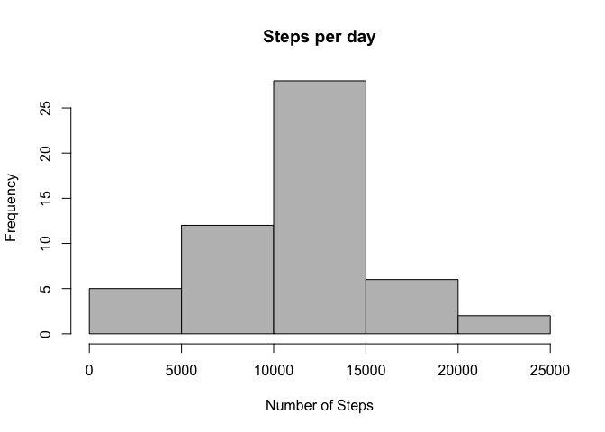
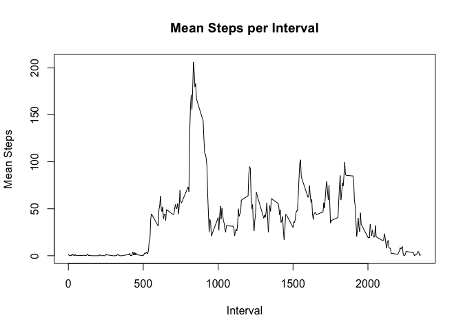
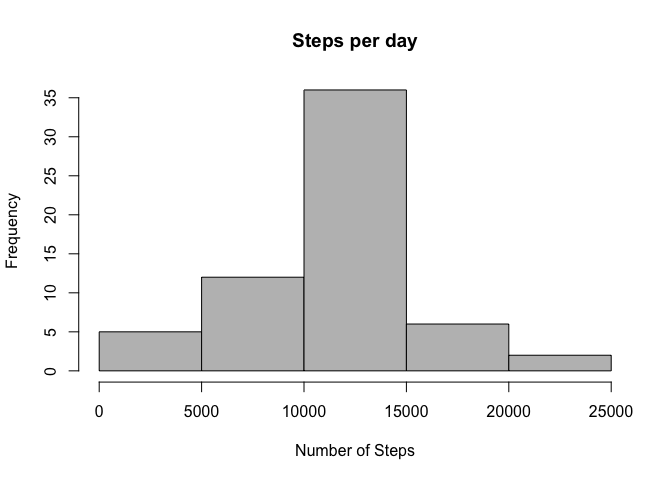
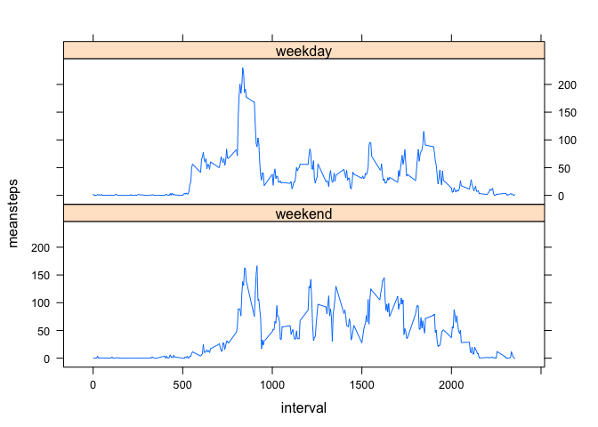

# Reproducible Research: Peer Assessment 1

## Loading and preprocessing the data
First set the working directory.

```r
setwd("/Users/waterman/Documents/Data Science Courses/Reproducible Research/Project1/RepData_PeerAssessment1")
```
Now reading the data into a data frame.

```r
activitydata <- read.csv("./activity.csv", stringsAsFactors = FALSE)
```

## What is mean total number of steps taken per day?

The number of steps taken each day.

```r
library(plyr)
stepsperdaydata <- ddply(activitydata, c("date"), summarize, steps = sum(steps), rm.na=TRUE)
```
Histogram of the "Number of Steps per Day"

```r
hist(stepsperdaydata$steps, 
     main="Steps per day",
     xlab="Number of Steps",
     col="grey"
    )
```

 
<br>Calculating and printing the mean number of steps per day.

```r
meanstepsperday <- mean(stepsperdaydata$steps, na.rm = TRUE)
```
The mean number of steps per day is 10766.19.
<br><br>
Calculating and printing the median number of steps per day.

```r
medianstepsperday <- median(stepsperdaydata$steps, na.rm = TRUE)
```
The median steps per day is 10765.  

## What is the average daily activity pattern?
Calculate the mean steps per interval (for this section NAs have been removed which will impact the interpretation of the data).

```r
meanstepsperintervaldata <- ddply(activitydata, c("interval"), summarize, meansteps = mean(steps, na.rm = TRUE))
```
This bit of R script produces a the Time Series plot of the mean steps per interval.

```r
plot(meanstepsperintervaldata$interval, meanstepsperintervaldata$meansteps,
     type="l",
     main="Mean Steps per Interval", 
     ylab="Mean Steps",
     xlab="Interval"
    )
```

 
<br>This bit of code sorts the intervals by size in descending order and prints the interval that contains the largest number of steps.

```r
maxinterval <- meanstepsperintervaldata[order(-meanstepsperintervaldata$meansteps), ]
head(maxinterval, n=1)
```

```
##     interval meansteps
## 104      835  206.1698
```
Based on R scrip, the interval that has the larges number of steps on average 835.

## Imputing missing values
This piece of R scipt counts and prints the number of rows with missing values.

```r
countNAs <- (sum(is.na(activitydata)))
print(countNAs)
```

```
## [1] 2304
```
The following R script replaces the intervals with NAs with the mean of that interval.
This is achieved in three steps: 
1. A function is built that replaces the value passed to it with itself or the mean of the variable if the value is NA.
2. A new data frame with the mean interval value replacing NAs is created using ddply and the new function. 
3.The data frame is reordered by date then interval.

```r
impute.mean <- function(x) replace(x, is.na(x), mean(x, na.rm = TRUE))
newactivitydata <- ddply(activitydata, ~ interval, transform, steps = impute.mean(steps))
newactivitydata <- newactivitydata[order(newactivitydata$date), ]
```
Recreating the Histogram of the "Number of Steps per Day"

```r
newstepsperdaydata <- ddply(newactivitydata, c("date"), summarize, steps = sum(steps), rm.na=TRUE)
hist(newstepsperdaydata$steps, 
     main="Steps per day",
     xlab="Number of Steps",
     col="grey"
    )
```

 
<br>Calculating new mean and median steps per day.

```r
newmeanstepsperday <- mean(newstepsperdaydata$steps, na.rm = TRUE)
print(newmeanstepsperday)
```

```
## [1] 10766.19
```

```r
newmedianstepsperday <- median(newstepsperdaydata$steps, na.rm = TRUE)
print(newmedianstepsperday)
```

```
## [1] 10766.19
```
The newly calculated mean is 10766.19 and the newly calculated median is 10766.19. Changing the NAs to the mean of the interval value does not change the reported mean, however the median is shifted and is now equal to the original reported mean. <br><br>
The impact of imputing missing data on the estimates of the total daily number of steps would be dependent upon the question be asked. Based on the question you are trying to answer, you would need to decide whether that was the most appropriate course of action and document your rational accordingly. 

## Are there differences in activity patterns between weekdays and weekends?
This part of the R script creates a vector containing the days in the weekend. The weekdays function and and the newly created weekendlist vector and then used to create a factor with two levels – “weekday” and “weekend”.

```r
weekendlist <- c('Saturday','Sunday')
newactivitydata$weekend <- factor((weekdays(as.Date(activitydata$date)) %in% weekendlist), 
                                   levels=c(TRUE, FALSE),
                                   labels=c('weekend','weekday'))
```
Here a new data frame is created that contains the mean number of steps for each interval grouped by the weekend or weekday.

```r
newmeanstepsperintervaldata <- ddply(newactivitydata, c("interval", "weekend"), 
                                     summarize, meansteps = mean(steps, na.rm = TRUE))
```
Now the lattice library is called and a plot for both meansteps by interval for both weekdays and weekend days are created.

```r
library(lattice)
xyplot(meansteps ~ interval | weekend, data = newmeanstepsperintervaldata, type="l", layout=c(1,2)) 
```

 
